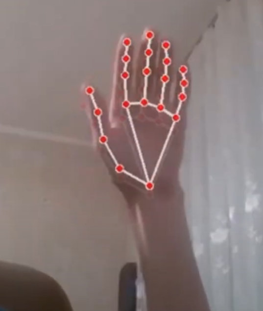

## Hackathon website https://devpost.com/software/browser-gestures-contol

## Watch the video

[](https://youtu.be/e6nFpbgzzNI)

- [create python env](https://docs.python.org/3/library/venv.html)

## Pose movements

- [Hand Pose Estimation And Classification](https://github.com/NVIDIA-AI-IOT/trt_pose_hand)

## Vue extension starter pack

- [vue-web-extension](https://github.com/Kocal/vue-web-extension)

## Tensorflow js

- [tensor operations](https://www.tensorflow.org/js/guide/tensors_operations)
- [einsum tensorflow explained](https://www.tensorflow.org/api_docs/python/tf/einsum)
- [export models to tensorlow js](https://www.tensorflow.org/js/tutorials/conversion/import_keras)

```
tensorflowjs_converter --input_format keras ./models/model.h5 ./models_js/
```
